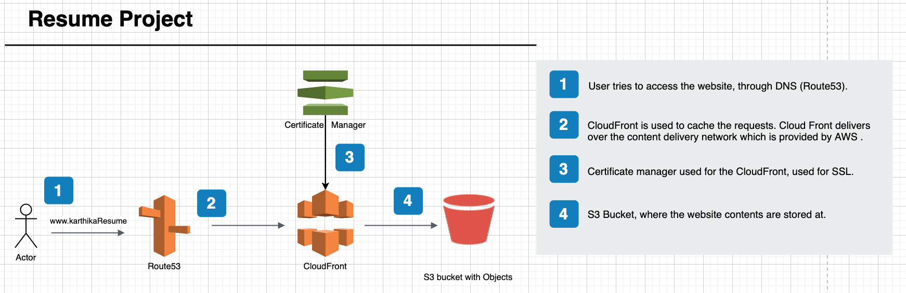

##  Resume Website: 

Through this project, I learned how to use different AWS services: CloudFront, S3, CertificateManager, Route53. Now I have hands-on knowledge of creating a website with a domain through with the aws services! 

Solution Architecture Diagram for my website!
-------------------------------------------------------------------------------------------------------------------------------------------------------------------

